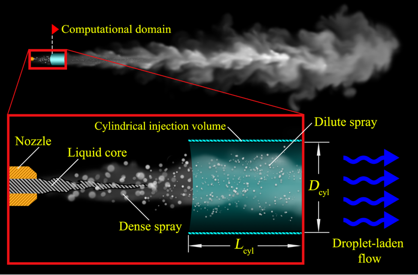

# ConeCylinderInjection: Extend Lagrangian parcels injection into 3D.


## Table of contents
* [Description](#description)
* [How to use](#how-to-use)
* [Contact](#contact)
* [Citing](#citine)
* [References](#references)
* [License](#license)

## Description

Cone cylindrical injection submodel that extends the 2D `disc` coneInjection
model, implemented in `lagrangianIntermediate` library, into 3D. This allows
better handling of the Lagrangian data especially when lots of parcels are
injected on the 2D disc that occasional solver crashes were reported.

In the new model, computational parcels are randomly injected from cylinder
of fixed height. The parameters for position, direction, cone
angles, and disc inner and outer diameters are all preserved for the new 
model, while the parameters `hCylinder` and `offsetCylinder` are required
to set the cylinder height and offset from injector position.
Therefore, instead of injecting parcels over a disc (i.e. 2D surface), they are
introduced randomly within a 3D finite volume cylinder.


An artistic illustration of the cylindrical injection model is depicted in the
following figure. Further details can found in [[1]](#1)

<p align="center">

</p>
<p align="center">
<em>Artistic illustration of the cone cylindrical injection model, while
    setting a solid cylinder geometry (zero inner diameter). Source: https://doi.org/10.3390/en13133360</em>
</p>

The class `ConeCylinderInjection` implementing the present model is in the same
level as `ConeInjection` class, i.e. they both inherit from templated 
`InjectionModel`.


## How to use

* Compile the library by executing `Allwmake` 

* Link the library during solver runTime. This is achieved by adding the
  following to `system/controlDict` of the simulation case directory.

```
libs
(
    "libconeCylinderInjection.so"
);
```

* Choose cylinder injection model from the corresponding subdictionary in
  `constant/sprayCloudProperties` as in the following example.

```
    injectionModels
    {

        model1
        {
            type            coneCylinderInjection;
            injectionMethod cylinder;

            // Geometry
            position        (-0.15 -0.1 0);
            direction       (1 0 0);
            thetaInner      0;
            thetaOuter      45;
            dInner          0;
            dOuter          0.05;
            hCylinder       0.05;
            offsetCylinder  0.0;

            .
            .
            .

        }
    }
```

## Contact

- Mahmoud Gadalla (mahmoud.gadalla@aalto.fi)
- Bulut Tekgül (buluttekgul@gmail.com)
- Heikki Kahila (heikki.kahila@wartsila.com)

## Citing

If you use our model, please consider citing both works [[1]](#1) and [[2]](#2)
in the references.

## References

</p>
</details>

<a id="1">[1]</a> 
M. Gadalla, J. Kannan, B. Tekgül, S. Karimkashi, O. Kaario, V. Vuorinen.
Large-Eddy Simulation of ECN Spray A: Sensitivity Study on Modeling
Assumptions. Energies. 13(13):3360.
[10.3390/en13133360](https://doi.org/10.3390/en13133360) (2020).
<details>
<summary>BibTex</summary>
<p>

```
@article{Gadalla2020,
    author = {Gadalla, Mahmoud and Kannan, Jeevananthan and Tekg{\"{u}}l, Bulut and Karimkashi, Shervin and Kaario, Ossi and Vuorinen, Ville},
    doi = {10.3390/en13133360},
    issn = {1996-1073},
    journal = {Energies},
    month = {jul},
    number = {13},
    pages = {3360},
    publisher = {MDPI AG},
    title = {{Large-Eddy Simulation of ECN Spray A: Sensitivity Study on Modeling Assumptions}},
    volume = {13},
    year = {2020}
}
```
</p>
</details>

<a id="2">[2]</a> 
H. Kahila, A. Wehrfritz, O. Kaario, M. G. Masouleh, N. Maes, B. Somers,
V. Vuorinen. Large-eddy simulation on the influence of injection pressure
in reacting Spray A. Combustion and Flame, Volume 191, Pages 142-159.
[10.1016/j.combustflame.2018.01.004](https://doi.org/10.1016/j.combustflame.2018.01.004)
(May 2018)

<details>
<summary>BibTex</summary>
<p>

```
@article{Kahila2018,
  doi = {10.1016/j.combustflame.2018.01.004},
  url = {https://doi.org/10.1016/j.combustflame.2018.01.004},
  year = {2018},
  month = may,
  publisher = {Elsevier {BV}},
  volume = {191},
  pages = {142--159},
  author = {Heikki Kahila and Armin Wehrfritz and Ossi Kaario and Mahdi Ghaderi Masouleh and Noud Maes and Bart Somers and Ville Vuorinen},
  title = {Large-eddy simulation on the influence of injection pressure in reacting Spray A},
  journal = {Combustion and Flame}
}
```
</p>
</details>

## License

`ConeCylinderInjection` library follows the GNU General Public License.
See the [LICENSE](LICENSE) file for license rights and limitations.
